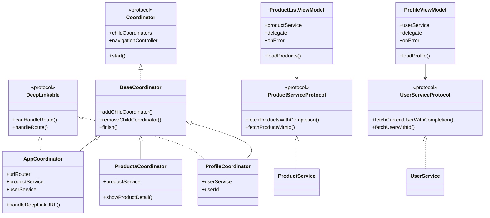

# MVVM-C Pattern with Deep Linking - ARC Version

A complete implementation of the MVVM-C (Model-View-ViewModel-Coordinator) pattern with deep linking support for ARC (Automatic Reference Counting) Objective-C projects.

## ✨ Features

- **Dependency Injection** - All components accept injected dependencies for testability
- **Protocol-Based Design** - `ProductServiceProtocol`, `UserServiceProtocol`, `Coordinator`, `DeepLinkable`
- **Deep Linking** - Custom URL schemes and Universal Links support
- **Modern Logging** - Uses `os_log` for efficient, privacy-aware logging
- **Accessibility** - Full VoiceOver support with accessibility identifiers
- **Design System** - Centralized constants for consistent UI

## 🏗️ Architecture

```
┌─────────────────────────────────────────────────────────────────┐
│                        AppDelegate                               │
│                            │                                     │
│                    ┌───────▼───────┐                             │
│                    │ AppCoordinator │◄──── URLRouter             │
│                    └───────┬───────┘                             │
│                            │                                     │
│              ┌─────────────┼─────────────┐                       │
│              │             │             │                       │
│     ┌────────▼────────┐  ┌─▼──────────┐ ┌▼─────────────┐         │
│     │ProductsCoordinator│ │ProfileCoord│ │SettingsCoord│         │
│     └────────┬────────┘  └────────────┘ └──────────────┘         │
│              │                                                   │
│     ┌────────▼────────┐                                          │
│     │ProductDetailCoord│                                         │
│     └─────────────────┘                                          │
└─────────────────────────────────────────────────────────────────┘
```

## 📁 Project Structure

```
MVVM-C-ARC/
├── Protocols/
│   ├── Coordinator.h          # Base coordinator protocol
│   └── DeepLinkable.h         # Deep link handling protocol
├── Services/
│   ├── ProductServiceProtocol.h
│   ├── ProductService.h/m
│   ├── UserServiceProtocol.h   # NEW
│   └── UserService.h/m         # NEW
├── Constants/
│   └── DesignConstants.h
├── TestSupport/
│   ├── ProductTestFixtures.h/m
├── Routing/
│   ├── DeepLinkRoute.h/m
│   └── URLRouter.h/m
├── Coordinators/
│   ├── BaseCoordinator.h/m
│   ├── AppCoordinator.h/m
│   ├── ProductsCoordinator.h/m
│   ├── ProductDetailCoordinator.h/m
│   └── ProfileCoordinator.h/m  # NEW
├── ViewModels/
│   ├── ProductListViewModel.h/m
│   ├── ProductDetailViewModel.h/m
│   └── ProfileViewModel.h/m    # NEW
├── ViewControllers/
│   ├── ProductListViewController.h/m
│   ├── ProductDetailViewController.h/m
│   └── ProfileViewController.h/m # NEW
└── Models/
    ├── Product.h/m
    └── User.h/m                # NEW
```

## 🔧 Dependency Injection

### ViewModel Injection

```objc
// Create service
id<ProductServiceProtocol> productService = [ProductService defaultService];

// Inject into ViewModel
ProductListViewModel *viewModel = [[ProductListViewModel alloc] 
    initWithProductService:productService];
```

### Coordinator Injection

```objc
// Full DI setup
AppCoordinator *coordinator = [[AppCoordinator alloc] 
    initWithWindow:window
         urlRouter:[[URLRouter alloc] initWithScheme:@"myapp"]
    productService:[ProductService defaultService]
       userService:[UserService defaultService]];
```

### Testing with Mocks

```objc
// Create mock service
MockProductService *mockService = [[MockProductService alloc] init];
mockService.mockProducts = @[testProduct];

// Inject mock
ProductListViewModel *viewModel = [[ProductListViewModel alloc] 
    initWithProductService:mockService];
```

## 🔗 Deep Linking

### Supported URLs

| URL | Description |
|-----|-------------|
| `myapp://products` | Product list |
| `myapp://products/123` | Product detail |
| `myapp://products/123/reviews` | Product reviews |
| `myapp://profile` | User profile (current user) |
| `myapp://profile/user_001` | User profile (specific user) |
| `myapp://settings` | Settings |
| `myapp://cart` | Shopping cart |

### Testing Deep Links

```bash
xcrun simctl openurl booted "myapp://profile"
xcrun simctl openurl booted "myapp://products/101/reviews"
```

## 🎨 Design Constants

```objc
#import "DesignConstants.h"

// Layout
view.layer.cornerRadius = kCornerRadiusLarge;  // 10.0
stackView.spacing = kPaddingMedium;             // 16.0

// Accessibility
button.accessibilityIdentifier = kAccessibilityAddToCartButton;
```

## 📊 Class Diagram



## 🧪 Memory Management

| Relationship | Reference Type | Reason |
|--------------|----------------|--------|
| Parent → Child Coordinator | `strong` | Parent owns children |
| Child → Parent Coordinator | `weak` | Breaks retain cycle |
| ViewModel → Delegate | `weak` | Coordinator owns ViewModel |
| ViewController → ViewModel | `strong` | VC needs ViewModel |

## 📝 Logging

Uses `os_log` for efficient, privacy-aware logging:

```objc
os_log_info(log, "Loaded %lu products", (unsigned long)count);
os_log_error(log, "Error: %{public}@", error.localizedDescription);
```

View logs in Console.app with subsystem filter: `com.bengidev.mvvmc`

## 📱 Requirements

- iOS 12.0+
- Xcode 15.0+
- Objective-C with ARC

## 📄 License

Educational purposes - MIT License
